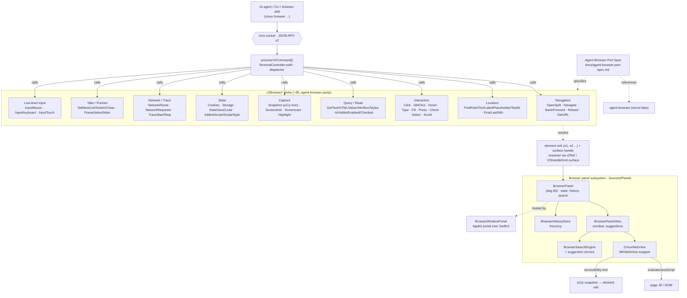

# cmux — Browser Automation Flow

> Derived from a graphify knowledge graph of `agisota/cmux` (fork of `manaflow-ai/cmux`).
> Edges are AST-EXTRACTED unless noted. cmux ships an in-app, scriptable browser whose
> command surface is a WKWebView port of [`vercel-labs/agent-browser`](https://github.com/vercel-labs/agent-browser),
> exposed to AI agents over the same Unix-socket control-plane as the terminal.

## How a command flows (example: `cmux browser click e3`)

1. Agent sends JSON-RPC over the socket → `processV2Command()` dispatches to `v2BrowserClick()`.
2. The verb resolves the **element ref** `e3` (and the target **surface handle**) via `v2Ref` / `V2HandleKind.surface` to a live `BrowserPanel`.
3. `BrowserPanel` → `CmuxWebView` (WKWebView) performs the action by `evaluateJavaScript` against the resolved DOM node.
4. Read-style verbs (`Snapshot`, `GetText`) return the **accessibility tree**, which is how agents obtain stable element refs in the first place.

## Key facts & WKWebView constraints

| Element | Note |
|---|---|
| ~85 `v2Browser*` verbs | Near-complete parity with `vercel-labs/agent-browser`, ported onto WKWebView. |
| Element refs (`e1`, `e2`…) | Ephemeral handles minted from the a11y snapshot; stable within a snapshot generation. |
| `CmuxWebView` | The single WKWebView bridge — all DOM interaction funnels through `evaluateJavaScript`. |
| Platform gaps (rationale) | WKWebView lacks CDP-style per-context proxy and a CDP video pipeline → some upstream agent-browser features are approximated or unavailable. |
| Same control-plane | Browser verbs share the socket dispatcher with terminal/window verbs — see [control-plane.md](./control-plane.md). |

## Why this matters for the fork

The browser surface is half of cmux's agent-automation value. Any fork work on
new `v2Browser*` verbs, locator strategies, or WKWebView workarounds lands in
`Sources/Panels/BrowserPanel*.swift` + `CmuxWebView.swift`, is dispatched from
`processV2Command()`, and should track the `agent-browser` port spec for parity.
