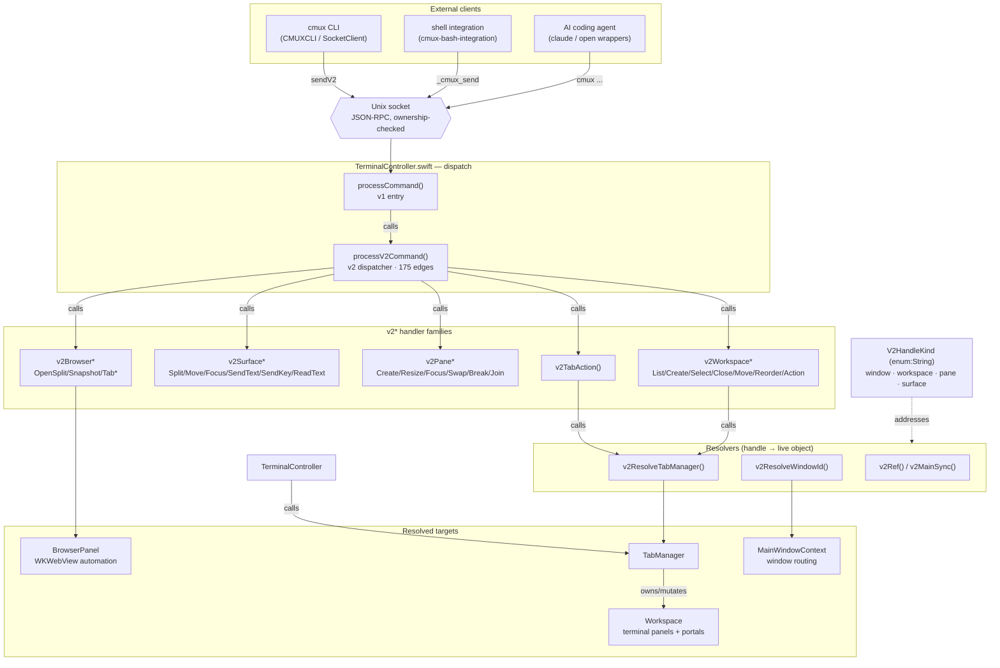

# cmux — Socket Control-Plane Architecture

> Derived from a graphify knowledge graph of `agisota/cmux` (fork of `manaflow-ai/cmux`).
> All edges below are AST-EXTRACTED (verified), not inferred.
> The socket/CLI control-plane — not the UI — is the architectural spine: it is how
> the CLI, shell integration, and AI coding agents programmatically drive terminals,
> the in-app browser, and windows.

## Legend / invariants

| Element | Meaning |
|---|---|
| `processV2Command()` | Single dispatch bottleneck (degree 175). Every external command enters here — one place to enforce focus/access/idempotency policy. |
| `V2HandleKind` | Opaque handle model `{window, workspace, pane, surface}`. The external API speaks string handles (`surface:N`); resolvers map them to live Swift objects. |
| `v2ResolveTabManager()` | The bridge: turns a workspace/tab handle into a concrete `TabManager`. The one true edge from the protocol layer to terminal state. |
| v1 → v2 | `processCommand()` (flat v1 API) delegates to `processV2Command()` (handle-based JSON-RPC v2) — a protocol-evolution refactor. |

## Why this matters for the fork

The control-plane is the product's reason to exist: AI agents drive cmux through this
socket surface. Any fork change touching agent automation, the socket API, or new
`v2*` verbs lands in `Sources/TerminalController.swift` around `processV2Command()`,
and must respect the handle-resolution contract above.
